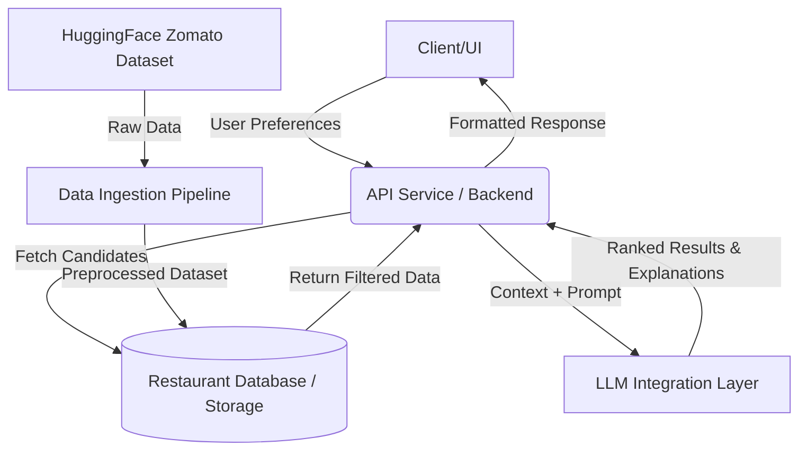

# System Architecture: AI-Powered Restaurant Recommendation System

This document outlines the detailed architecture for the Zomato-inspired AI-Powered Restaurant Recommendation System, based on the requirements defined in `context.md`.

## 1. High-Level Architecture Overview

The system follows a modular, multi-tier architecture to separate data handling, business logic, and LLM integration.

## 2. Core Components

### 2.1. Data Ingestion Pipeline
**Purpose:** Fetches, cleans, and stores the raw dataset into a structured format for fast querying.
- **Source:** Hugging Face dataset (`ManikaSaini/zomato-restaurant-recommendation`).
- **Processing:** Extracts essential fields (Name, Location, Cuisine, Cost, Rating). Handles missing values, normalizes cost/ratings, and standardizes cuisine names.
- **Storage:** Stores processed data into a Database or in-memory DataFrame (e.g., SQLite, PostgreSQL, or Pandas for simpler setups).

### 2.2. Backend / API Service
**Purpose:** Acts as the central orchestrator of the system.
- **Endpoints:** Provides RESTful or GraphQL APIs to accept user preferences (Location, Budget, Cuisine, Min Rating, Extra).
- **Filtering Engine (Hard Constraints):** Before sending data to the LLM, the backend queries the database using exact matches or ranges (e.g., rating >= 4.0, location == 'Delhi') to retrieve a candidate pool of 10-20 restaurants. This reduces LLM token usage and latency.

### 2.3. LLM Integration Layer
**Purpose:** Interacts with the Large Language Model to perform reasoning, ranking, and explanation generation.
- **Prompt Engineering:** Constructs a detailed prompt injecting the user's specific context alongside the JSON/CSV formatted candidate pool.
- **LLM Provider:** Integrates with the Groq API for LLM inference.
- **Parsing:** Ensures the LLM outputs structured data (e.g., JSON schema) so the backend can reliably extract the Top N ranked restaurants and their associated AI-generated explanations.

### 2.4. Client / Output Display
**Purpose:** The user-facing interface.
- **Input Form:** Collects Location, Budget, Cuisine, Minimum Rating, and open-text additional preferences (e.g., "good for anniversaries", "quick service").
- **Results View:** Renders the final curated list of restaurants, showcasing:
  - Restaurant Name, Cuisine, Rating, Estimated Cost
  - The human-like **AI-generated explanation** for why it was recommended.

## 3. Data Flow / System Workflow

1. **User Request:** The user submits their dining preferences via the UI.
2. **Pre-filtering:** The Backend API receives the request and performs a lightweight query against the Restaurant Database.
   - *Example: Fetch up to 15 Italian restaurants in Bangalore with Rating > 4.0 and Medium budget.*
3. **Prompt Construction:** The API takes the filtered subset and builds a prompt string containing both the User's exact prompt/preferences and the candidate restaurants' metadata.
4. **LLM Inference:** The API makes an asynchronous call to the LLM. The LLM evaluates the candidates based on nuances (e.g., matching "family-friendly" or "romantic" against the restaurant names or known traits if available) and ranks them.
5. **Response Formatting:** The API receives the LLM's ranked output, validates the format, and maps it back to the original database entities to ensure data accuracy.
6. **Delivery:** The structured response is sent back to the Client to be displayed to the user.

## 4. Recommended Tech Stack

- **Data Ingestion:** Python (Pandas/Hugging Face `datasets` library)
- **Backend Framework:** FastAPI (Python) - *Excellent for async LLM calls and automatic Swagger documentation.*
- **Database:** SQLite (for local MVP) or PostgreSQL.
- **LLM Provider:** Groq (for ultra-low latency inference).
- **Frontend (Optional):** React.js, Streamlit, or a simple Jinja2 template depending on project scope.
